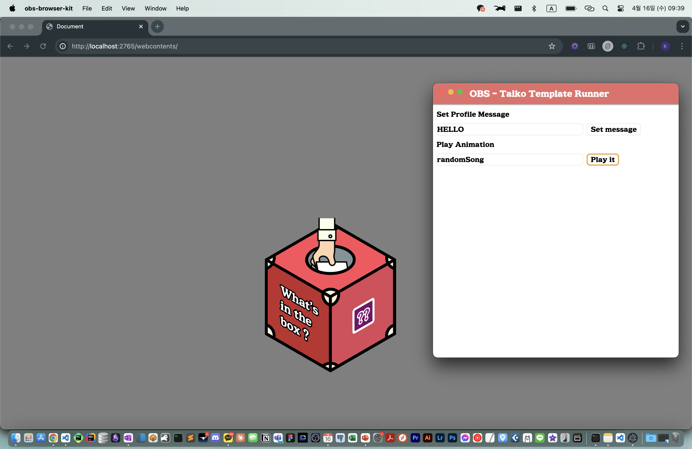
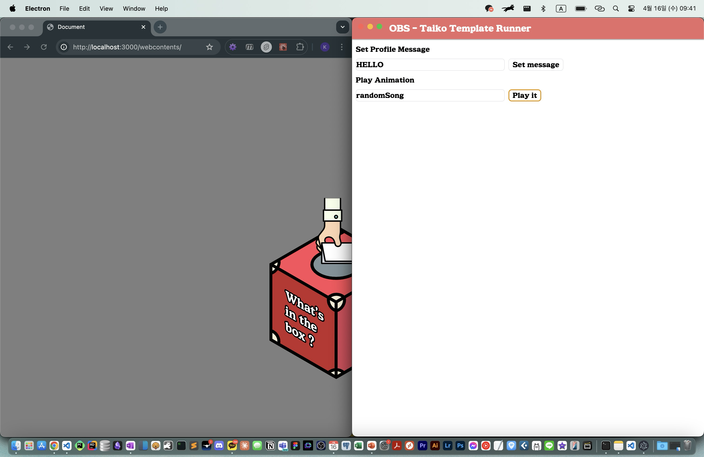

# OBS Browser Taiko

This app is designed for using at my Taiko no Tatsujin Broadcasting.

---
### How to build it.

```shell
npm run package
```

App will be built on 
./out/obs-browser-kit-{YOUR_OS}

If your system is macOS (Apple M-Chip)
```plaintext
(root)/
├── src/
│   └── ...
└── out/
    └── obs-browser-kit-darwin-arm64/
        └── obs-browser-kit.app
```

Then run the app and it will starts express server at PORT 2765.



Currently, only one animation registered. I'll update for how to register animation.

---


### Dev mode
```shell
npm run dev
```

Then, it will start vite server.



While dev server on, you can use HMR of webContents at the browser (localhost:3000)

